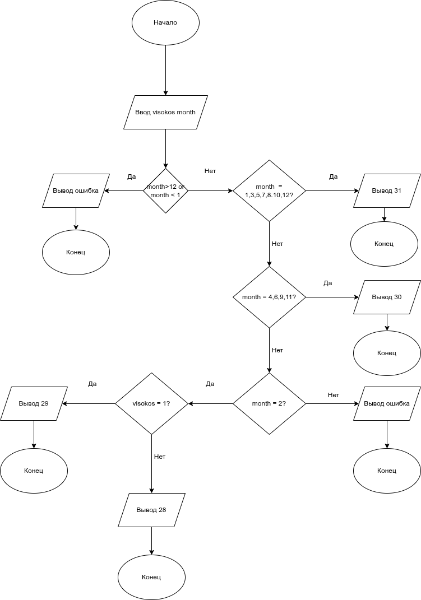

# Домашнее задание к работе 7

## Условие задачи

Составить программу, которая в зависимости от порядкового номера месяца выводит количество дней в этом месяце.
Предусмотреть возможность выбора года — високосный или не високосный.

---

## 1. Алгоритм и блок-схема

### Алгоритм

```
1. Начало

2. Ввести номер месяца (month)

3. Ввести признак високосного года (visokos)
   (1 — високосный, 0 — не високосный)

4. Проверить значение month:
   4.1. Если month = 1, 3, 5, 7, 8, 10, 12 → дней = 31
   4.2. Если month = 4, 6, 9, 11 → дней = 30
   4.3. Если month = 2:
        a) Если visokos = 1 → дней = 29
        b) Иначе → дней = 28
   4.4. Иначе → сообщение об ошибке

5. Вывести количество дней в выбранном месяце

6. Конец
```

---

### Блок-схема



*Рис. 1 — Блок-схема алгоритма определения количества дней в месяце.*

---

## 2. Реализация программы

```c
#include <stdio.h>

int main() {
    int month;
    int visokos; 
    int days;

    printf("Введите номер месяца (1–12): ");
    scanf("%d", &month);

    printf("Год високосный? (1 — да, 0 — нет): ");
    scanf("%d", &visokos);

    switch (month) {
        case 1: case 3: case 5: case 7: case 8: case 10: case 12:
            days = 31;
            break;
        case 4: case 6: case 9: case 11:
            days = 30;
            break;
        case 2:
            if (visokos == 1)
                days = 29;
            else
                days = 28;
            break;
        default:
            printf("Ошибка: номера месяца %d не существует.\n", month);
            return 1;
    }

    printf("В месяце %d — %d дней.\n", month, days);
    return 0;
}
```

---

## 3. Результаты работы программы

```
Введите номер месяца (1–12): 2
Год високосный? (1 — да, 0 — нет): 1
В месяце 2 — 29 дней.
```

```
Введите номер месяца (1–12): 9
Год високосный? (1 — да, 0 — нет): 0
В месяце 9 — 30 дней.
```

---

## 4. Информация о разработчике

[Андреев Артём бТИИ-251]

---
